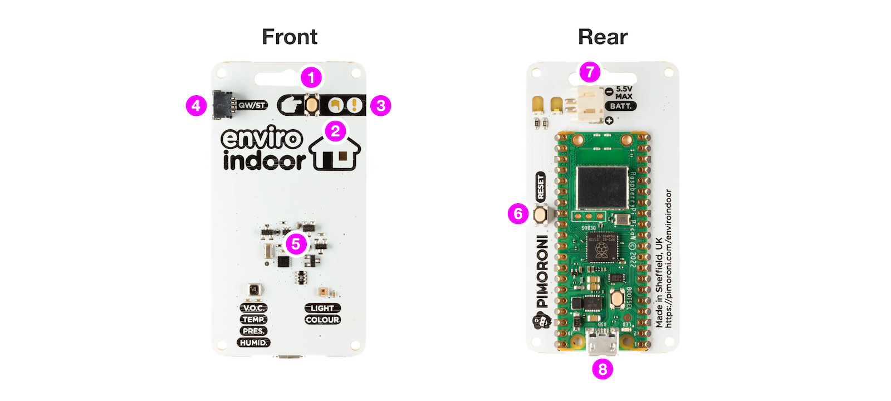

# Getting started with Enviro

- [Getting started with Enviro](#getting-started-with-enviro)
  - [An overview of what's on the board](#an-overview-of-whats-on-the-board)
  - [Step 1: Power up](#step-1-power-up)
  - [Step 1: Connect to your Enviro](#step-1-connect-to-your-enviro)

## An overview of what's on the board

Many features can be found on all versions of Enviro - these provide the base functionality of deep sleep, user interaction, powering the board, and attaching accessories.

It's a good idea to familiarise yourself with where the buttons and indicators are before you start setting up your board.

- <big>①</big> **POKE** button: wakes the board from sleep to take an ad hoc reading
- <big>②</big> **ACTIVITY** LED (white): pulses gently when the board is awake (quickly when in provisioning mode)
- <big>③</big> **WARNING** LED (red): blinks if an error occurs (e.g. the wireless connection is down)
- <big>④</big> Qw/ST connector: a convenient way to add extra sensors
- <big>⑤</big> Sensors: the collection of sensors that the board gathers data from (vary depending on board type)
- <big>⑥</big> **RESET** button (rea): resets the board (hold **POKE** while resetting to force back into provisioning mode)
- <big>⑦</big> Battery connector: JST type connector compatible with many battery holders and cells
- <big>⑧</big> USB connector: microB USB connector for accessing logs and reading files

*Note: The sensors (item 5 in the list above) are different for each type of board - sometimes wildly so!*

When you recieve your Enviro board it will come preloaded with our software but will not be configured yet. You need to go through the provisioning process to tell it how to connect to your wireless network, when to take readings, and optionally where to upload them.

Follow these instructions to get your Enviro board configured and running:

## Step 1: Power up

Plug in your battery or USB cable and press the **POKE** button on the front of the board to wake it up - after a second or so the **ACTIVITY** LED will start to pulse slowly.

https://user-images.githubusercontent.com/297930/182666569-947d6b1e-1fe6-4cff-a3aa-eb71b397e5ed.mp4

If you haven't previously configured this board then it will automatically go into provisioning (setup) mode. The **ACTIVITY** LED will pulse rapidly.

*Note: You can use 3xAA or 3xAAA (either alkaline or NiMH), a single cell LiPo battery, or a USB cable to power Enviro boards.*

## Step 1: Connect to your Enviro

Once in provisioning mode your Enviro will appear as a new wireless network that you can connect to.

*Enviro showing up as an access point during provisioning mode*

Use your phone, tablet, or computer to connect to this network and after a few seconds the setup process will pop up ready for you to start.

