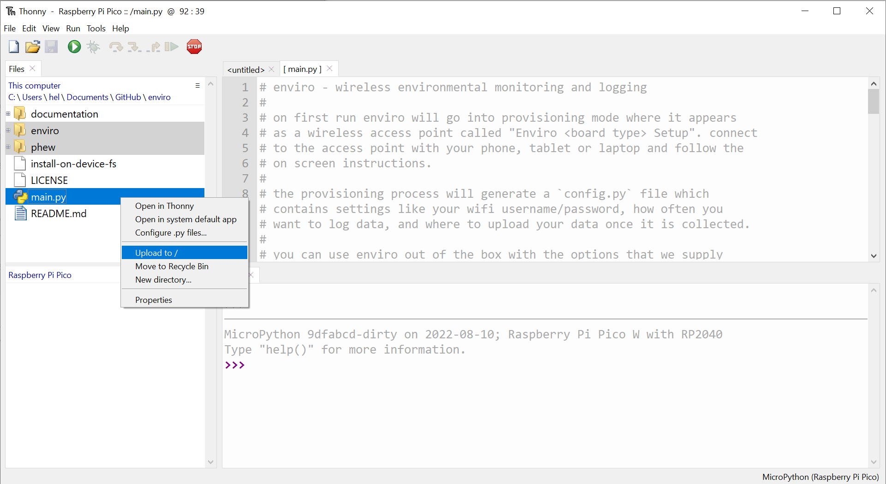

# Upgrading Firmware <!-- omit in toc -->
- [Downloading MicroPython](#downloading-micropython)
- [Installing MicroPython](#installing-micropython)
- [Downloading the Enviro software](#downloading-the-enviro-software)
  - [Transferring files using the Linux command line](#transferring-files-using-the-linux-command-line)
  - [Transferring files using Thonny](#transferring-files-using-thonny)
- [Starting from scratch](#starting-from-scratch)

Here's how to update the firmware and software on your Enviro board for all the latest fixes and tweaks! These instructions should also work if you're setting up an Enviro board from scratch.

## Downloading MicroPython

You can download the most recent version of our custom MicroPython firmware from the link below. 

- https://github.com/pimoroni/pimoroni-pico/releases

You can find the list of .uf2 image files under 'Assets' - make sure you pick the one for **pimoroni-picow-enviro**.

## Installing MicroPython

Plug Enviro into your computer (or tap RESET if it's already plugged in) whilst pressing the BOOTSEL button on the Pico W. This will put the board into DFU mode and it will show up as a drive on your computer called **RPI-RP2**.

Copy the .uf2 file across to this drive. Your Pico W will then reboot running the latest version of MicroPython.

⚠Note that you only need to use DFU mode when uploading the MicroPython image. You can't copy other files to it this way - you'll need to communicate with it using Thonny (or another interpreter).

## Downloading the Enviro software

Clone this repo to your computer so you have a local copy:

`git clone https://github.com/pimoroni/enviro --recursive`

(we're using the `--recursive` flag so that it downloads the phew submodule as well - phew is a small web server library). 

Alternatively, you could download the Enviro repo as a zip file using the green 'code' dropdown on the [front page](https://github.com/pimoroni/enviro). If you do it this way, it won't download the phew files, but you can install `micropython-phew` easily from within Thonny (Tools > Manage Packages).

### Transferring files using the Linux command line

If you're running Linux and are happy using command line tools you can use our `install-on-device-fs` script to copy the files across easily. You'll need to install `mpremote` if you don't have it installed already (`pip3 install mpremote`). You may need to edit the script to change `pattern="/dev/tty.usbmodem1*"` to match the location of your USB device (find it using `lsusb`).

You can also use this method on Windows using Windows Subsystem for Linux, though you will need to [set up USB passthrough](https://docs.microsoft.com/en-us/windows/wsl/connect-usb) to enable WSL to see the Pico W.

### Transferring files using Thonny

Alternatively, if you'd rather avoid the command line, you could copy the files to your Pico W using Thonny. Open up the Files window if you can't see it (View > Files).

Navigate to the downloaded enviro files on your computer in the top box. You'll need to copy across the `enviro` and `phew` subdirectories and `main.py` to your Pico  - right click on em and select 'Upload to /'.

Once that's done, the files on your Pico W should look something like this (though you'll see more files and directories if you've provisioned your device and if you've been using it to log data). 

Hit reset and your board should resume logging (or enter provisioning if that's not been done yet).

## Starting from scratch

Need to delete everything from your board and start from scratch? You can do that by downloading [this special .uf2 file](https://www.raspberrypi.org/documentation/pico/getting-started/static/6f6f31460c258138bd33cc96ddd76b91/flash_nuke.uf2) and copying it to Enviro whilst it's in bootloader/DFU mode. Once you've done that, you'll need to follow all the steps in this guide again.

⚠ Beware! Doing this will delete **everything** - including all your logged data and configuration details.

